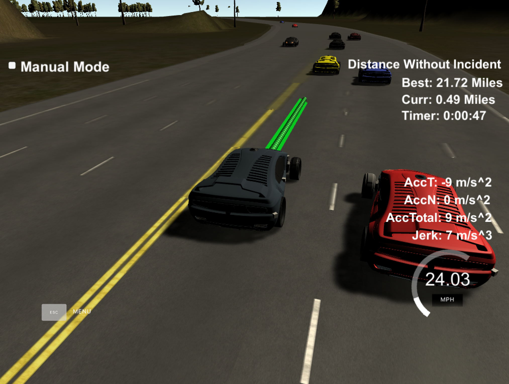
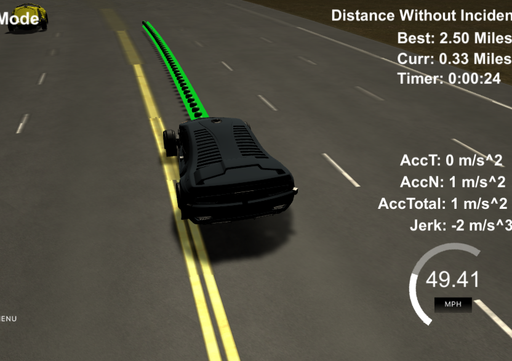

# CarND-Path-Planning-Project
Self-Driving Car Engineer Nanodegree Program
   
### Simulator.
You can download the Term3 Simulator which contains the Path Planning Project from the [releases tab (https://github.com/udacity/self-driving-car-sim/releases).

### Goals
In this project your goal is to safely navigate around a virtual highway with other traffic that is driving +-10 MPH of the 50 MPH speed limit. You will be provided the car's localization and sensor fusion data, there is also a sparse map list of waypoints around the highway. The car should try to go as close as possible to the 50 MPH speed limit, which means passing slower traffic when possible, note that other cars will try to change lanes too. The car should avoid hitting other cars at all cost as well as driving inside of the marked road lanes at all times, unless going from one lane to another. The car should be able to make one complete loop around the 6946m highway. Since the car is trying to go 50 MPH, it should take a little over 5 minutes to complete 1 loop. Also the car should not experience total acceleration over 10 m/s^2 and jerk that is greater than 10 m/s^3.

#### The map of the highway is in data/highway_map.txt
Each waypoint in the list contains  [x,y,s,dx,dy] values. x and y are the waypoint's map coordinate position, the s value is the distance along the road to get to that waypoint in meters, the dx and dy values define the unit normal vector pointing outward of the highway loop.

The highway's waypoints loop around so the frenet s value, distance along the road, goes from 0 to 6945.554.

## Basic Build Instructions

1. Clone this repo.
2. Make a build directory: `mkdir build && cd build`
3. Compile: `cmake .. && make`
4. Run it: `./path_planning`.

Here is the data provided from the Simulator to the C++ Program

#### Main car's localization Data (No Noise)

["x"] The car's x position in map coordinates

["y"] The car's y position in map coordinates

["s"] The car's s position in frenet coordinates

["d"] The car's d position in frenet coordinates

["yaw"] The car's yaw angle in the map

["speed"] The car's speed in MPH

#### Previous path data given to the Planner

//Note: Return the previous list but with processed points removed, can be a nice tool to show how far along
the path has processed since last time. 

["previous_path_x"] The previous list of x points previously given to the simulator

["previous_path_y"] The previous list of y points previously given to the simulator

#### Previous path's end s and d values 

["end_path_s"] The previous list's last point's frenet s value

["end_path_d"] The previous list's last point's frenet d value

#### Sensor Fusion Data, a list of all other car's attributes on the same side of the road. (No Noise)

["sensor_fusion"] A 2d vector of cars and then that car's [car's unique ID, car's x position in map coordinates, car's y position in map coordinates, car's x velocity in m/s, car's y velocity in m/s, car's s position in frenet coordinates, car's d position in frenet coordinates. 

## Details

1. The car uses a perfect controller and will visit every (x,y) point it recieves in the list every .02 seconds. The units for the (x,y) points are in meters and the spacing of the points determines the speed of the car. The vector going from a point to the next point in the list dictates the angle of the car. Acceleration both in the tangential and normal directions is measured along with the jerk, the rate of change of total Acceleration. The (x,y) point paths that the planner recieves should not have a total acceleration that goes over 10 m/s^2, also the jerk should not go over 50 m/s^3. (NOTE: As this is BETA, these requirements might change. Also currently jerk is over a .02 second interval, it would probably be better to average total acceleration over 1 second and measure jerk from that.

2. There will be some latency between the simulator running and the path planner returning a path, with optimized code usually its not very long maybe just 1-3 time steps. During this delay the simulator will continue using points that it was last given, because of this its a good idea to store the last points you have used so you can have a smooth transition. previous_path_x, and previous_path_y can be helpful for this transition since they show the last points given to the simulator controller with the processed points already removed. You would either return a path that extends this previous path or make sure to create a new path that has a smooth transition with this last path.

## Tips

A really helpful resource for doing this project and creating smooth trajectories was using http://kluge.in-chemnitz.de/opensource/spline/, the spline function is in a single hearder file is really easy to use.

---

## Dependencies

* cmake >= 3.5
 * All OSes: [click here for installation instructions](https://cmake.org/install/)
* make >= 4.1
  * Linux: make is installed by default on most Linux distros
  * Mac: [install Xcode command line tools to get make](https://developer.apple.com/xcode/features/)
  * Windows: [Click here for installation instructions](http://gnuwin32.sourceforge.net/packages/make.htm)
* gcc/g++ >= 5.4
  * Linux: gcc / g++ is installed by default on most Linux distros
  * Mac: same deal as make - [install Xcode command line tools]((https://developer.apple.com/xcode/features/)
  * Windows: recommend using [MinGW](http://www.mingw.org/)
* [uWebSockets](https://github.com/uWebSockets/uWebSockets)
  * Run either `install-mac.sh` or `install-ubuntu.sh`.
  * If you install from source, checkout to commit `e94b6e1`, i.e.
    ```
    git clone https://github.com/uWebSockets/uWebSockets 
    cd uWebSockets
    git checkout e94b6e1
    ```

## Editor Settings

We've purposefully kept editor configuration files out of this repo in order to
keep it as simple and environment agnostic as possible. However, we recommend
using the following settings:

* indent using spaces
* set tab width to 2 spaces (keeps the matrices in source code aligned)

## Code Style

Please (do your best to) stick to [Google's C++ style guide](https://google.github.io/styleguide/cppguide.html).

## Project Instructions and Rubric

Note: regardless of the changes you make, your project must be buildable using
cmake and make!


## Call for IDE Profiles Pull Requests

Help your fellow students!

We decided to create Makefiles with cmake to keep this project as platform
agnostic as possible. Similarly, we omitted IDE profiles in order to ensure
that students don't feel pressured to use one IDE or another.

However! I'd love to help people get up and running with their IDEs of choice.
If you've created a profile for an IDE that you think other students would
appreciate, we'd love to have you add the requisite profile files and
instructions to ide_profiles/. For example if you wanted to add a VS Code
profile, you'd add:

* /ide_profiles/vscode/.vscode
* /ide_profiles/vscode/README.md

The README should explain what the profile does, how to take advantage of it,
and how to install it.

Frankly, I've never been involved in a project with multiple IDE profiles
before. I believe the best way to handle this would be to keep them out of the
repo root to avoid clutter. My expectation is that most profiles will include
instructions to copy files to a new location to get picked up by the IDE, but
that's just a guess.

One last note here: regardless of the IDE used, every submitted project must
still be compilable with cmake and make./

## How to write a README
A well written README file can enhance your project and portfolio.  Develop your abilities to create professional README files by completing [this free course](https://www.udacity.com/course/writing-readmes--ud777).


## Reflection
### Code Model
Line 298 - 439 outlines the entire code model in three major methods:

1. Detect Surrounding Cars (line 301 - 317)
This part detects cars around given current car state and other vehicle data out of sensor fusion results. The goal is to tell if current car may collide with car in front of self or on side. Basically it loops through all cars around and predict potential collision in mayCollide() method (line 186 - 212). The prediction is pretty naive since it assume in the time frame of the trajectory, all cars maintain constant speed. Then in any of the timestamp, if surrounding car got closer (threshold distance defined in consts.h). We can tell the logic here is oversimplified for in real world car will usually accelerate upon switching to a different lane. The case other cars moving to this lane or suddenly speeding up is compensated by given more buffer distance between the cars.

2. Make Decision about Acceleration and Switching Lane (line 319 - 334)
Given the likelihood of collision hazard on potential path, we make intuitive decisions pretty similar to those made in daily ride: if not blocked ahead, just speed up to speed limit. If we may collide with car in front, try if we can switch aside. If that’s not feasible, we may have to slow down to avoid rear-ending. Basically it’s a simplified finite state machine with four state: 
a. Maintain lane and speed up
b. Slow down
c. Change to left lane if possible
d. Change to right lane if possible
The output is target lane (0 is left lane. 1 is middle lane. 2 is right lane) and acceleration. Note acceleration is the delta speed after 0.02s time span, which has three possible values: MAX_DECELERATION (negative to slow down), 0, MAX_ACCELERATION (positive to speed up). Since 10m/s^3 is max jerk, so in 0.02s
it can speed up to 0.02s * 10 * 2.24 miles/s^3. To avoid going beyond that,  MAX_ACCELERATION is set to 4.5 * 0.02 * 2.24 and MAX_DECELERATION to -4.5 * 0.02 * 2.24, so that MAX_ACCELERATION - MAX_DECELERATION = 9 * 0.02 * 2.24. This only considers jerk along to s direction.
No complicated states like preparing to switch lane are considered for it won’t help much with achieving the goal of this project: safety, feasibility, comfort and efficiency. Instead of using a weighted cost function to evaluate multiple potential trajectories, this piece of code simply tries to maximize the speed (by setting MAX_ACCELERATION without triggering the comfort alarm) while maintaining sensible distance with surrounding cars.

3. Trajectory Generation (line 336 - 438)
Trajectory would be generated according the target lane and acceleration. Basically this function creates a list of widely spaced (x, y) waypoints, evenly spaced at 30m and interpolate them with a spline and fill with more points. Firstly to realize a smooth transition from previous state, it tried to generate two points that forms a vector tangible with current car direction (if previous path are finished) or end of previous path. Then under Frenet coordinates add evenly 30m spaced points ahead of  car’s s read (if previous path are finished) or end of previous path. After transforming to local coordinates, the car is facing ahead and the added target point is at exactly (30, 0) (it’s almost impossible to travel 30m in 0.02m, so it’s enough to only generate path for 30m). Then we try to predict next 1s by creating a path of 50 points. If there are left points from previous moment, we just have to provide remaining points. Reference velocity of care would be implied through setting the distance between the points. The speed diff calculated out of makeDecisionBasedOnEnv() function would be added up to current velocity and bound with speed limit. Since previous points and spline interpolation happened in car’s local coordinates, final result shall be converted back and eventually pushed back to control advancing of the car.

The code model can easily drive the car safely (without exceeding max speed, acceleration or jer, riding the lane or hitting other cars) for over 20 miles.





### Thoughts
Though the code enables the car to drive safely, the car is observed to constantly step on the solid lane. The reason is the lane info is provided by discrete points in csv file instead of continuous computer vision output. In reality camera or more sensor observation should be involved to provide lane information (Eg. what if there is construction and 3 normal lanes are merged into one). 



