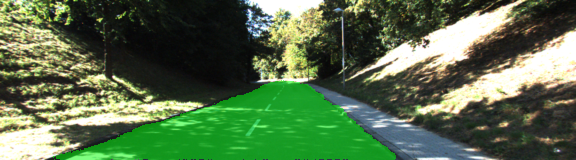
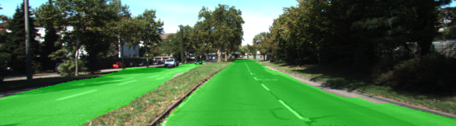
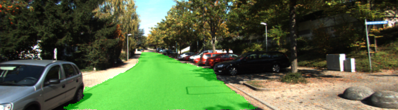

# Semantic Segmentation
### Introduction
Semantic segmentation using Fully Convolutional Network (FCN) is applied to Kitti test data to identify road pixels.

#### Architecture
The architecture of network mimics the [FCN paper](./2016-FCN-paper.pdf). Pre-trained VGG layers are borrowed to form the encoder part of the FCN (line 20 - 43 in main.py). Three layer of the original VGG layers are bridged through 1 by 1 convolution (line 53 - 58 in main.py) before unsampled to form the output with the same size of the input (line 60 - 101 in main.py). Skip connection technique is applied on VGG layer 3 and 4. L2 regularizer was used as shown in Project Walkthrough to prevent large weights that causes over drifting. Cross entropy loss is used to measure the training performance in each epoch (line 119). Drop out rate was picked as 50%. Training was executed with a batch size of 8 and learning 8e-5 for 40 epochs. 

#### Results
Loss is observed to decrease during the 40 epochs to around 0.025.
```
Tests Passed
Tests Passed
Tests Passed
Tests Passed
Tests Passed
Train NN using the train_nn function
Finished epoch 1 out of 40. Loss: 0.6319.
Finished epoch 2 out of 40. Loss: 0.1341.
Finished epoch 3 out of 40. Loss: 0.1348.
Finished epoch 4 out of 40. Loss: 0.1064.
Finished epoch 5 out of 40. Loss: 0.2472.
Finished epoch 6 out of 40. Loss: 0.1554.
Finished epoch 7 out of 40. Loss: 0.0368.
Finished epoch 8 out of 40. Loss: 0.0556.
Finished epoch 9 out of 40. Loss: 0.0548.
...
Finished epoch 34 out of 40. Loss: 0.0382.
Finished epoch 35 out of 40. Loss: 0.0328.
Finished epoch 36 out of 40. Loss: 0.0174.
Finished epoch 37 out of 40. Loss: 0.0395.
Finished epoch 38 out of 40. Loss: 0.0117.
Finished epoch 39 out of 40. Loss: 0.0235.
Finished epoch 40 out of 40. Loss: 0.0257.
Save inference data.
Training Finished. Saving test images to: ./runs/1520261722.831187
```
Further training could bring it even lower, while not tested since training is pretty time consuming. Below are some segmentation result to illustrate effectiveness of this approach. We can tell majority of the road pixels are correctly identified despite complicated environments like shadow and vehicles.






### Setup
##### Frameworks and Packages
Make sure you have the following is installed:
 - [Python 3](https://www.python.org/)
 - [TensorFlow](https://www.tensorflow.org/)
 - [NumPy](http://www.numpy.org/)
 - [SciPy](https://www.scipy.org/)
##### Dataset
Download the [Kitti Road dataset](http://www.cvlibs.net/datasets/kitti/eval_road.php) from [here](http://www.cvlibs.net/download.php?file=data_road.zip).  Extract the dataset in the `data` folder.  This will create the folder `data_road` with all the training a test images.

### Start
##### Implement
Implement the code in the `main.py` module indicated by the "TODO" comments.
The comments indicated with "OPTIONAL" tag are not required to complete.
##### Run
Run the following command to run the project:
```
python main.py
```
**Note** If running this in Jupyter Notebook system messages, such as those regarding test status, may appear in the terminal rather than the notebook.

### Submission
1. Ensure you've passed all the unit tests.
2. Ensure you pass all points on [the rubric](https://review.udacity.com/#!/rubrics/989/view).
3. Submit the following in a zip file.
 - `helper.py`
 - `main.py`
 - `project_tests.py`
 - Newest inference images from `runs` folder  (**all images from the most recent run**)
 
 ### Tips
- The link for the frozen `VGG16` model is hardcoded into `helper.py`.  The model can be found [here](https://s3-us-west-1.amazonaws.com/udacity-selfdrivingcar/vgg.zip)
- The model is not vanilla `VGG16`, but a fully convolutional version, which already contains the 1x1 convolutions to replace the fully connected layers. Please see this [forum post](https://discussions.udacity.com/t/here-is-some-advice-and-clarifications-about-the-semantic-segmentation-project/403100/8?u=subodh.malgonde) for more information.  A summary of additional points, follow. 
- The original FCN-8s was trained in stages. The authors later uploaded a version that was trained all at once to their GitHub repo.  The version in the GitHub repo has one important difference: The outputs of pooling layers 3 and 4 are scaled before they are fed into the 1x1 convolutions.  As a result, some students have found that the model learns much better with the scaling layers included. The model may not converge substantially faster, but may reach a higher IoU and accuracy. 
- When adding l2-regularization, setting a regularizer in the arguments of the `tf.layers` is not enough. Regularization loss terms must be manually added to your loss function. otherwise regularization is not implemented.
 
### Using GitHub and Creating Effective READMEs
If you are unfamiliar with GitHub , Udacity has a brief [GitHub tutorial](http://blog.udacity.com/2015/06/a-beginners-git-github-tutorial.html) to get you started. Udacity also provides a more detailed free [course on git and GitHub](https://www.udacity.com/course/how-to-use-git-and-github--ud775).

To learn about REAMDE files and Markdown, Udacity provides a free [course on READMEs](https://www.udacity.com/courses/ud777), as well. 

GitHub also provides a [tutorial](https://guides.github.com/features/mastering-markdown/) about creating Markdown files.
